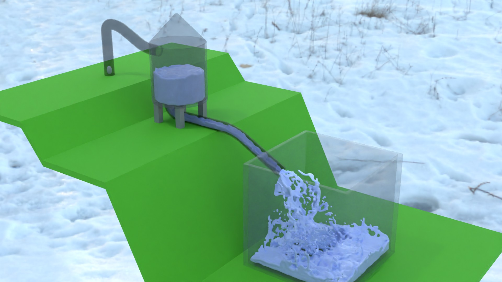
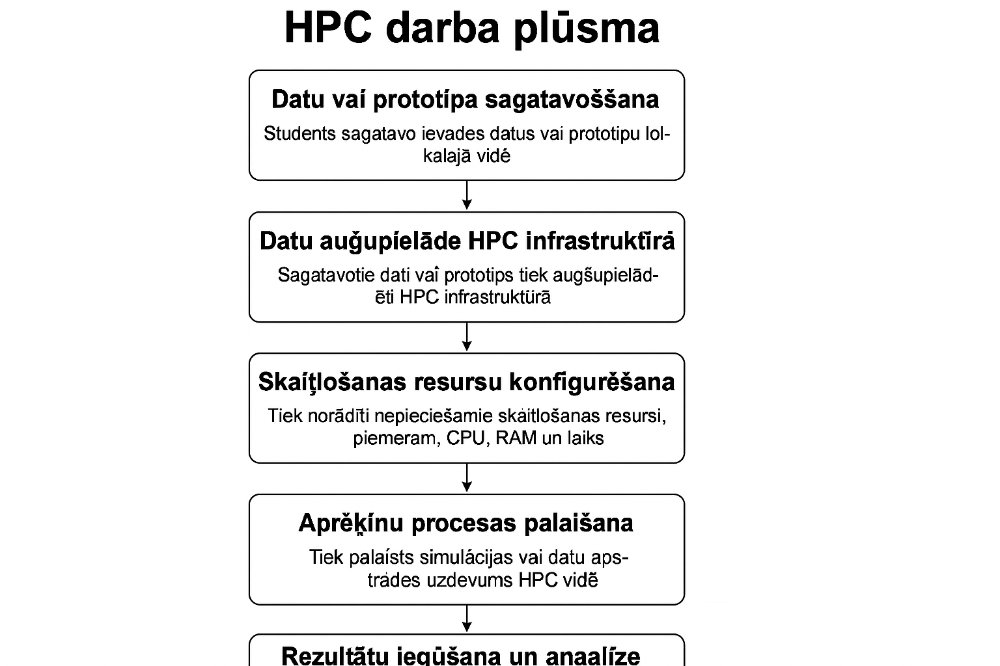

--------------------------------
Creating project: Fill_tank
--------------------------------
# Fill_tank

# 🌊 3D Ūdens gravitācijas simulācija Blender vidē + HPC darba plūsma
# 🌊 3D Water Gravity Simulation in Blender + HPC Workflow

# 🇱🇻 LATVISKĀ VERSIJA

## 📘 Apraksts  
Šajā uzdevumā students izveido **3D ūdens gravitācijas simulācijas modeli Blender programmā**, balstoties uz nodrošināto video pamācību.  
Modelis demonstrē:

- ūdens pacelšanu ar “sūkņa principu”,
- gravitācijas ietekmētu plūsmu pa kanāliem,
- trauku pakāpenisku piepildīšanu,
- Mantaflow fizikas darbību.

Pēc modeļa izveides tas tiek izpildīts **HPC klasterī**, kas būtiski samazina bake un renderēšanas laiku.

## 🎬 Video pamācība  
Zemāk norādīts YouTube video piemērs, kas soli pa solim demonstrē simulācijas izveidi:

▶ https://youtu.be/xaq2REK4nMw 

## 🖼️ HPC darba plūsmas shēma

## 🖥️ HPC resursi

Darbam uz HPC izmanto šos resursus

[HPC Scripts](../HPC_SCRIPTS/)  
[HPC Instructions](../HPC_instructions/)

## Blender fails

-  Folder Blender_file atrodas gatavs Blender projekta fails , kuru var izmantot simulācijai gan lokali , gan HPC resursos

## 🔄 HPC darba plūsma (kopsavilkums)

1️⃣ **Prototipa izveide** Blender vidē  
2️⃣ **Datu augšupielāde** uz HPC  
3️⃣ **Resursu konfigurēšana** (CPU, RAM, laiks)  
4️⃣ **Aprēķinu palaišana**  
5️⃣ **Rezultātu lejupielāde un analīze**

---

# 🇬🇧 ENGLISH VERSION

## 📘 Description  
In this assignment, the student creates a **3D water gravity simulation in Blender**, based on the provided tutorial video.  
The model demonstrates:

- water being lifted using a “pump-like” mechanism,
- gravity-driven flow through pipes or channels,
- sequential filling of containers,
- Mantaflow fluid physics configuration.

After the model is created, the simulation is executed on an **HPC cluster**, greatly reducing bake and render time.

---

## 🎬 Tutorial Video  
Example tutorial video (replace with your actual link):

▶ https://youtu.be/xaq2REK4nMw  

## 🖼️ HPC Workflow Diagram

## 🖥️ HPC Resources

## 📁 HPC Resources

For work with HPC uses this resources

[HPC Scripts](../HPC_SCRIPTS/)  
[HPC Instructions](../HPC_instructions/) 

## 🔄 HPC Workflow Summary

1️⃣ **Prototype creation** in Blender  
2️⃣ **Upload** project files to the HPC system  
3️⃣ **Configure compute resources** (CPU, RAM, runtime)  
4️⃣ **Run the simulation** on HPC  
5️⃣ **Download and analyze results**

