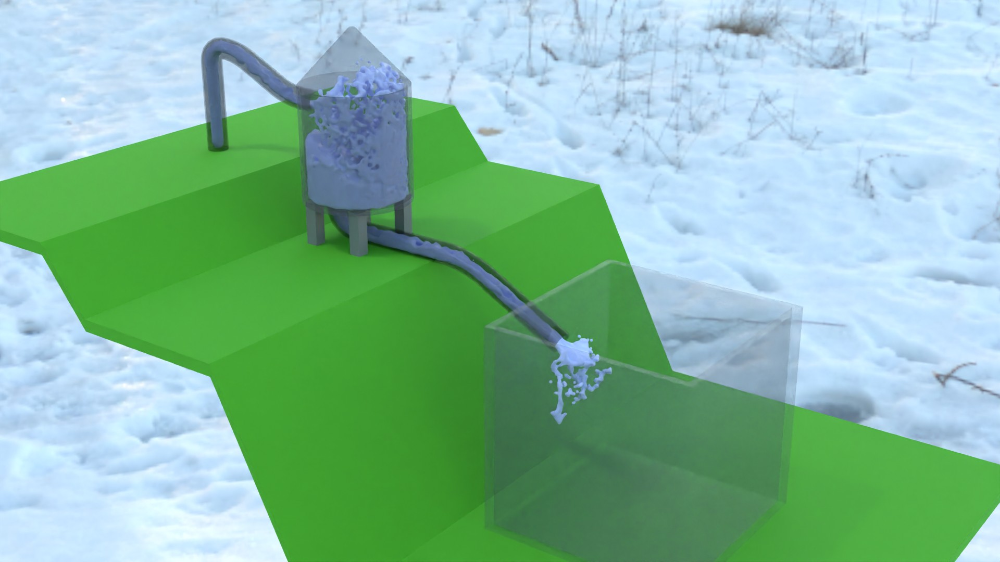
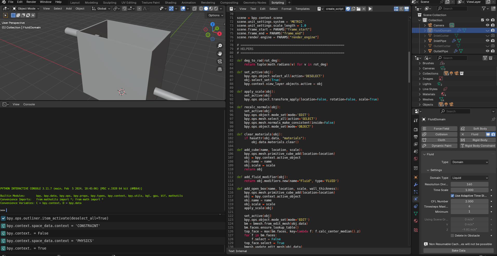
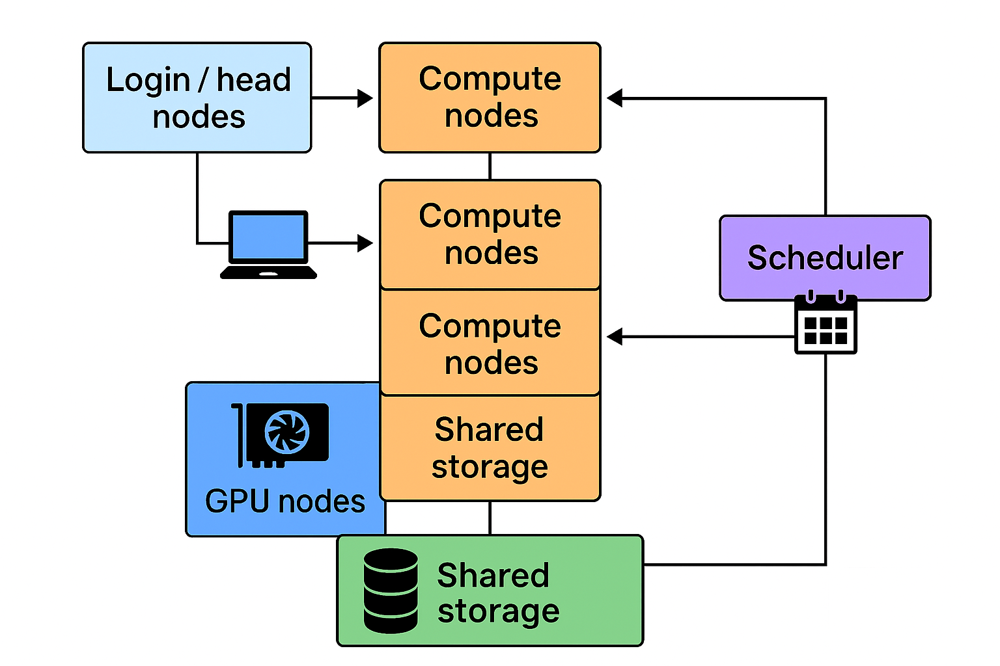
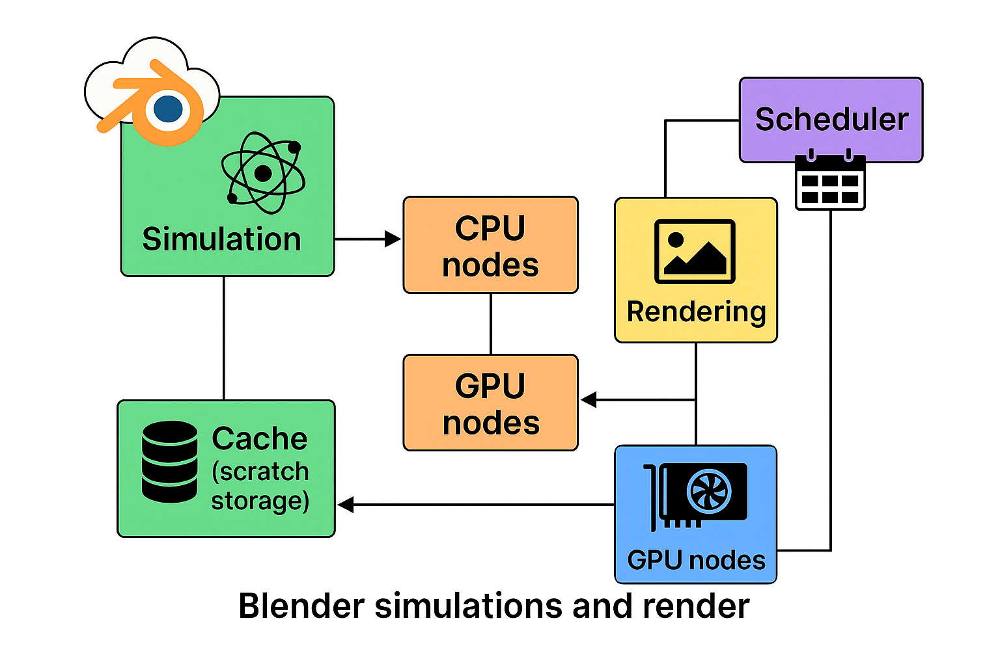
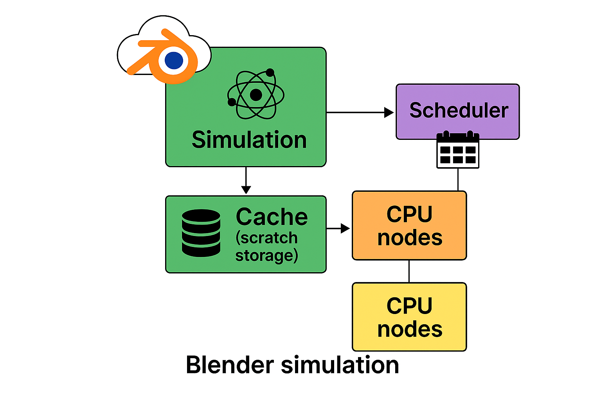
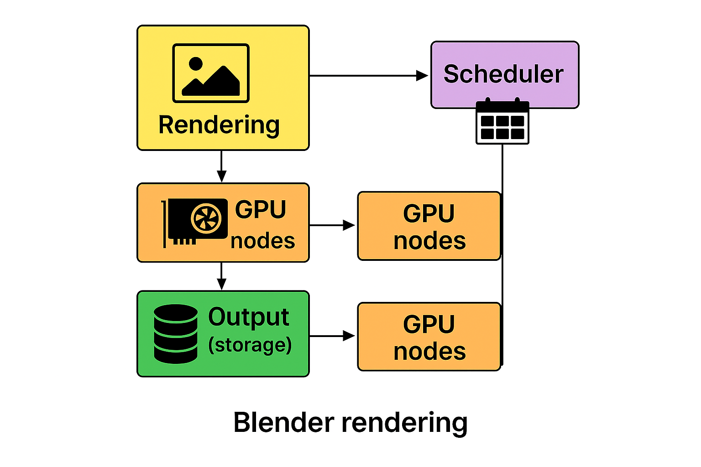

# Blender Fluid Gravity Projects 

# Problem Background / Problemas apraksts
LV
Augstas precizitātes ūdens gravitācijas simulācijas Blender vidē prasa lielu skaitļošanas jaudu. Mantaflow risina Navjē–Stoksa vienādojumus uz 3D vāktu režģa, un augstas izšķirtspējas režģi ir nepieciešami, lai precīzi atveidotu brīvās virsmas dinamiku, turbulenci un gravitācijas vadītu plūsmu. Pieaugot izšķirtspējai, strauji palielinās atmiņas patēriņš un simulācijas bake ilgums.
Inženiertehniskos un pētnieciskos uzdevumos gandrīz nekad nepietiek ar vienu simulācijas variantu. Bieži nepieciešams mainīt ģeometriju, ūdens tilpumu, gravitāciju, ieplūdes/izplūdes nosacījumus vai režģa izšķirtspēju. Šo scenāriju izpilde uz standarta datora ir lēna un neefektīva.
HPC klasteris ļauj paralēli izpildīt daudzas Blender simulācijas, izmantojot augstākas izšķirtspējas režģus un ievērojami samazinot bake laiku. Blender vizuālais interfeiss ļauj lietotājam detalizēti izpētīt sistēmas uzbūvi, plūsmas ceļus, šķēršļus un konstrukciju konfigurācijas, kas būtiski uzlabo sarežģītu hidraulisko procesu analīzi.

EN
High‑fidelity water‑gravity simulation in Blender requires significant computational resources. Mantaflow solves the Navier–Stokes equations on a voxel grid, and high resolutions are necessary to accurately represent free-surface behaviour, turbulence and gravitational flow. As resolution increases, memory use and computation time grow rapidly.
Engineering and research tasks rarely rely on a single simulation case. Multiple parameter variations — geometry, water volume, gravity settings, inflow/outflow conditions or voxel resolution — are needed to understand system behaviour. Running these simulations sequentially on a personal computer is slow and inefficient.
Using an HPC cluster allows parallel execution of many Blender simulations at once, enabling faster baking, higher resolutions and broader parameter exploration. Blender also provides a strong visual component, allowing users to examine geometry, flow paths, obstacles and system structure interactively in 3D, improving understanding and communication of complex hydraulic designs.

# Example Description / Piemēru apraksts

Šis repozitorijs satur divus atšķirīgus ūdens gravitācijas simulācijas piemērus, kas paredzēti gan izglītojošai demonstrācijai, gan izmantošanai uz HPC klastera, lai ievērojami paātrinātu bake un renderēšanas procesu.

## 1. Fill_tank — Blender vizuālais modelēšanas piemērs

LV:
Piemērs Fill_tank parāda, kā Blender vidē izveidot pilnu ūdens plūsmas sistēmu. Tajā sūknis uzsūknē ūdeni uz augšu, bet gravitācija nodrošina, ka ūdens pakāpeniski piepilda vairākus traukus. Iekļautā video demonstrācija soli pa solim parāda, kā veidot šo modeli Blender programmā — sākot no ģeometrijas izveides un fluid domēna konfigurācijas līdz fizikas iestatījumiem, ieplūdes avotiem un bake parametriem.
Šis piemērs ir īpaši noderīgs vizuālai izpratnei par objekta uzbūvi, plūsmas ceļiem un ūdens uzvedību gravitācijas ietekmē.

EN:
The Fill_tank example demonstrates how to build a complete water‑flow system directly inside Blender. In this setup, a pump lifts water upward, after which gravity causes the water to fill several containers. The included video demonstration shows a step‑by‑step workflow of how the example is created in Blender — from setting up geometry and fluid domains to configuring physics, inflow sources and baking parameters.
This example is ideal for visually understanding system geometry, object interactions and the physical behaviour of water under gravity.

## 2. Python‑based flow demo — automātiska piemēra ģenerēšana

LV:
Otrs piemērs demonstrē, kā ar Python skripta palīdzību var automātiski izveidot Blender ūdens plūsmas simulāciju. Skripts ģenerē ģeometriju, uzstāda fluid domēnu, definē ieplūdes/izplūdes avotus un konfigurē gravitācijas noteiktu kustību. Šī pieeja ļauj ātri izveidot dažādus simulāciju variantus un ir īpaši piemērota automatizētai izpildei uz HPC klastera.

EN:
The second example demonstrates how a Blender water‑flow simulation can be generated programmatically using a Python script. The script creates geometry, sets fluid domains, defines inflow/outflow sources and configures gravity‑driven motion. This approach allows rapid generation of simulation variations and is suitable for automated batch runs on an HPC cluster.

## 3. Abiem piemēriem — HPC priekšrocības

LV:
Abi piemēri ir paredzēti izpildei uz HPC klastera, kas nodrošina daudz ātrāku bake un renderēšanas procesu. Augstas izšķirtspējas šķidruma simulācijas, kuras uz parasta datora prasītu vairākas stundas, HPC vidē tiek izpildītas daudz efektīvāk, sadalot slodzi starp skaitļošanas mezgliem. Tas ļauj ātri eksperimentēt, iegūt tūlītēju vizuālo atgriezenisko saiti un strauji pārbaudīt jaunus parametrus vai konfigurācijas.

EN:
Both examples can be executed on an HPC cluster to achieve significantly faster baking and rendering times. High‑resolution fluid simulations that may take hours on a standard desktop machine can be completed much more efficiently when distributed across HPC compute nodes. This allows rapid experimentation, fast visual feedback and quick iteration of new designs or parameter settings.

# Software Prerequisites / Nepieciešamā programmatūra

LV
## Lai izpildītu šo piemēru, nepieciešams:

Blender (ieteicams 4,2 ar Mantaflow - HPC )
Python 3.x (papildus, ja nepieciešama automatizācija)
HPC klasteris ar darba rindas pārvaldnieku 
Skaitļošanas mezgli ar pietiekamu RAM un CPU kodolu skaitu augstas izšķirtspējas režģiem

EN
## To run this example, you need:

Blender (version recommended: 4.2 with Mantaflow)
Python 3.x (optional, for batch automation)
Access to an HPC cluster with a suitable job scheduler 
Node(s) with sufficient RAM and CPU cores for high‑resolution voxel grids

# HPC resursu lietošana ar Blender

Augstas veiktspējas skaitļošana (High-Performance Computing, HPC) tiek īstenota, izmantojot skaitļošanas klasterus, kurus nereti neformāli dēvē par superdatoriem. Neskatoties uz šo apzīmējumu, superdators parasti nav viens monolīts datorsistēmas mezgls, bet gan savstarpēji savienotu serveru kopums, kas kopīgi izpilda liela apjoma skaitļošanas uzdevumus efektīvāk nekā viena iekārta.

## 1. HPC klastera galvenās sastāvdaļas
Tipisks HPC klasteris sastāv no vairākām specializētām komponentēm:

• Pieslēgšanās mezgli (login/head nodes) – mezgli, kuros lietotāji pieslēdzas, izmantojot SSH protokolu, veic koda sagatavošanu, konfigurē palaišanas skriptus un pārvalda darbus. Šie mezgli nav paredzēti intensīvai skaitļošanai.

• Skaitļošanas mezgli (compute nodes) – klastera centrālie resursi, kuros notiek faktiska paralēlā skaitļošana. Atkarībā no klastera profila tie var būt optimizēti CPU aprēķiniem vai aprīkoti ar GPU, kas īpaši būtiski mašīnmācīšanās uzdevumos un simulāciju izpildē.

• Starpmezglu tīkls – parasti augstas caurlaidības un mazas latentuma infrastruktūra (piem., InfiniBand), kas nodrošina efektīvu datu apmaiņu starp mezgliem, kas ir kritiski paralēlām skaitļošanas metodēm.

• Koplietotās datu glabātuves – vairākas failu sistēmas ar dažādiem mērķiem, tostarp lietotāju mājas direktorijas, projektu teritorijas un pagaidu (scratch) diski.

• Darbu rindas pārvaldnieks (scheduler/job manager) – programmatūra (piem., Slurm, PBS), kas organizē resursu sadali starp lietotājiem, pārvalda rindas un kontrolē darbu izpildi.

## 2. Darbu izpilde: “netiešā” programmu palaišana
Atšķirībā no tradicionālām darba stacijām HPC vidē lietotājs programmu nepalaiž tieši uz mezgla. Tipiska darba plūsma ietver:

pieslēgšanos login mezglam,
ievaddatu un palaišanas skripta sagatavošanu,
darba iesniegšanu schedulerim,
darba izpildi, schedulerim piešķirot brīvos resursus.
Šāda pieeja nodrošina:

taisnīgu resursu sadali starp lietotājiem,
centralizētu lietošanas ierobežojumu kontroli (CPU/GPU, RAM, laika limiti),
efektīvu resursu izmantošanu, izvairoties no dīkstāves.
## 3. Paralelizācijas modeļi un paātrinājuma mehānismi
HPC klasteri paātrina aprēķinus, izmantojot dažādus paralelizācijas principus:

### 3.1. Neatkarīgo uzdevumu paralelizācija (High-Throughput Computing)
Šo pieeju izmanto, ja liels skaits līdzīgu uzdevumu var tikt izpildīti neatkarīgi. Piemēram, tūkstošiem skriptu ar dažādiem parametriem var tikt izpildīti paralēli dažādos mezglos vai procesoros.

### 3.2. Starpmezglu paralelizācija (MPI)
Lielapjoma simulācijas (piem., klimata modelēšana, šķidrumu dinamika) izmanto Message Passing Interface (MPI), kas nodrošina datu apmaiņu starp skaitļošanas procesiem dažādos mezglos.

### 3.3. Paralelizācija mašīnmācīšanās uzdevumos
Mašīnmācīšanās modeļiem bieži tiek izmantoti GPU-mezgli, izmantojot:

datu paralelizāciju, sadalot apmācības datus pa vairākiem GPU,
modeļa paralelizāciju, ja modelis neietilpst viena GPU atmiņā.
## 4. Resursu rindas sistēma (scheduler)
Darba iesniegšanas brīdī lietotājs specifikē nepieciešamos resursus, piemēram:

CPU kodolu un GPU skaitu,
pieejamo operatīvo atmiņu (RAM),
maksimālo izpildes laiku,
rindas/partīcijas tipu,
mezglu specifikācijas (ja nepieciešams).
Scheduleris ievieto darbu rindā, palaiž to, kad resursi kļūst pieejami, un pārtrauc izpildi, ja tiek pārkāpti noteiktie limiti.

## 5. Datu glabāšanas režīmi: “home” pret “scratch”
Lai efektīvi pārvaldītu datu plūsmas, HPC klasteros tiek nodalītas failu sistēmas ar atšķirīgu funkcionalitāti:

HOME – paredzēts kodam, konfigurācijām un citiem nelieliem, svarīgiem failiem; parasti ar dublēšanu (backup).
SCRATCH/PROJECT/TMP – liela apjoma un augstas veiktspējas glabātuve bez garantētas dublēšanas, paredzēta intensīvām I/O operācijām un starprezultātiem.
## 6. HPC priekšrocības salīdzinājumā ar jaudīgu individuālu datoru
Lai arī teorētiski iespējams iegādāties jaudīgu darba staciju, HPC klasteri sniedz būtiskas priekšrocības:

horizontāla mērogošana, ļaujot palielināt jaudu, pievienojot jaunus mezglus,
liela kopējā resursu bāze, tostarp ievērojami lielāks RAM un GPU skaits,
augstas veiktspējas tīkli un paralēlās failu sistēmas,
centralizēta administrēšana, kas nodrošina drošību, kvotu kontroli un efektīvu resursu sadali

Efektīva augstas veiktspējas skaitļošanas (HPC) izmantošana prasa prasmi izvēlēties pareizo resursu tipu — CPU vai GPU — atkarībā no uzdevuma struktūras, paralelizācijas potenciāla, atmiņas prasībām un izmantotā rīka (piemēram, Blender). Zemāk apkopoti principi un praktiski piemēri.

## 2. Kad izvēlēties CPU aprēķinus
CPU ir universālāki un efektīvāki uzdevumos, kuros dominē nelineāra loģika, daudz zarošanās un ierobežotas paralēlās iespējas.

### 1.1. CPU priekšrocības
CPU ir ieteicami situācijās, kad:

aprēķinos ir daudz nosacījuma konstrukciju (if, neregulāri cikli, dinamiska struktūra);
uzdevumi ir heterogēni vai sastāv no daudzām mazām, atšķirīgām operācijām;
nepieciešama ļoti liela RAM kapacitāte (simti GB vai TB, ko GPU nodrošināt nevar);
dominē intensīva I/O slodze (datu lasīšana/rakstīšana);
uzdevumi ietilpst klasiskajās HPC kategorijās:
skaitliskā plūsmas dinamika (CFD),
galīgo elementu metodes (FEM),
optimizācija,
Monte–Carlo metodes,
genomikas instrumenti (atkarīgs no rīka),
masīva datu apstrāde;
jāizpilda daudzi neatkarīgi uzdevumi (parameter sweep, HTC scenāriji).

### 1.2. CPU mērogošana
Viena mezgla līmenī: OpenMP, multithreading.
Star-mezglu līmenī: MPI, kur daudz procesi savstarpēji apmainās ar datiem

## 2. Kad izvēlēties GPU aprēķinus
GPU ir paredzēti masīvi paralēliem aprēķiniem un spīd situācijās, kur aprēķini reducējas uz matricām, vektoriem un ļoti lielu paralelizācijas pakāpi.

### 2.1. GPU priekšrocības
GPU ir optimālā izvēle, ja:

ir liels paralēlisms (tūkstošiem vai miljoniem identisku operāciju);
uzdevums ir matricu/tenzoru intensīvs, piemēram:
dziļā mašīnmācīšanās treniņš un inferencē (PyTorch, TensorFlow),
lineārā algebra (CuBLAS, CuSolver),
daļiņu simulācijas, signālapstrāde u.c.;
datus var noturēt GPU atmiņā, samazinot CPU–GPU kopēšanas laiku.
GPU dod lielu ieguvumu tikai tad, ja rīks reāli izmanto GPU (CUDA/ROCm). Pretējā gadījumā GPU var neko nepaātrināt.

Vairāk par HPC dalījumu var skatīt šeit https://hpc-guide.rtu.lv/03_hardware.html

## Blender un HPC
### 1. Uzdevumi, kas Blenderā vairāk piemēroti CPU
CPU parasti tiek izmantoti fizikas simulācijām, jo:

simulācijās ir daudz nelineāras loģikas un sadursmju aprēķinu, kas nav labi GPU paralelizējami;
simulācijas bieži prasa lielu RAM (augstas izšķirtspējas domēni, lieli cache faili);
bake un solve posmi mērogojas ar CPU kodoliem.
Tipiski CPU smagi uzdevumi Blender:

Mantaflow Fluid / Smoke / Fire simulācijas (bake/solve);
Rigid body dinamika ar daudziem objektiem;
Cloth un soft body simulācijas;
Hair/particles (atkarībā no setup);
Lielu cache apjomu izmantojoši projekti.
### 2. Uzdevumi, kas Blenderā vairāk piemēroti GPU
GPU dominē renderēšanā, it īpaši:

Cycles GPU render (CUDA/OptiX uz NVIDIA, HIP uz AMD);
Viewport render preview dažos gadījumos;
Renderēšanas fermas scenārijos, kur GPU dod milzīgu paātrinājumu.
Ja projekts būtībā ir "rendera ferma", GPU mezgli ir optimāla izvēle.

### Ieteikumi Blender uzdevumu izpildei HPC klasterī

#### Simulācijas (bake)
Izvēlēties CPU mezglus ar daudz kodoliem un lielu RAM.
Rezultātus glabāt scratch vai project failu sistēmās (nevis home).
Bieži izpilda vienu jobu (vai bakes segmentē, ja iespējams).
#### Renderēšana
Izmantot GPU mezglus.
Izveidot daudz paralēlu darbu: katrs job apstrādā 1–20 kadrus.
Šī metode ideāli izmanto HPC klasteri.
#### Praktiski HPC apsvērumi
Visi Blender darbi jāpalaiž caur scheduleri, nevis login mezglā.
Blender var strādāt headless režīmā (blender -b scene.blend -o output -f frame).
Failu sistēmas izvēlei ir kritiska nozīme:
simulācijas cache → scratch,
render output → scratch/project,
home → tikai mazām konfigurācijām

  <a href="HPC_instructions/README.md"><b>➡ HPC pieslēgšanās un darba izpilde</b></a>

  <a href="README_HPC.md"><b>➡ Iepazities ar HPC</b></a>

