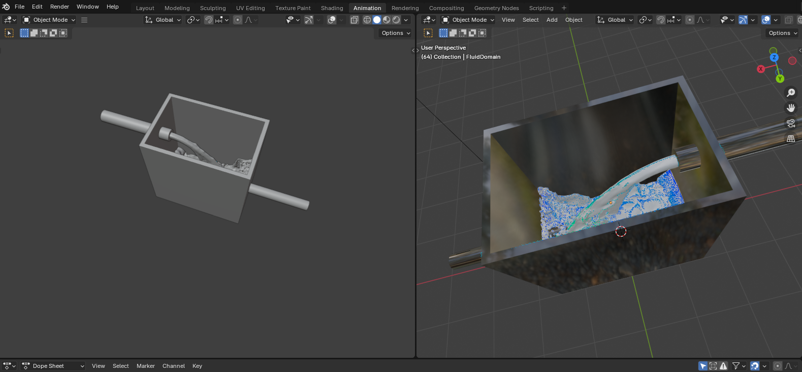
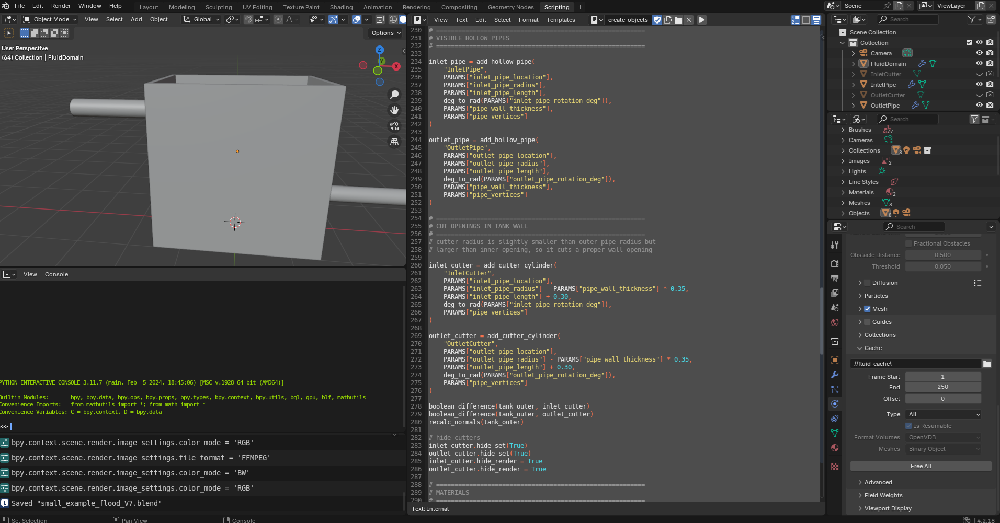

# Blender projekts ar Python kodu uzdevuma izpildei uz HPC 
# Language / Valoda

**Click your preferred language / Izvēlies valodu:**

- 🇱🇻 [Latviešu](#latvian)
- 🇬🇧 [English](#english)

---

# 🇱🇻 Latviešu {#latvian}

## Automatizēta Blender Mantaflow šķidruma simulācijas ģenerēšana ar HPC skaitļošanas atbalstu

Mērķis
Projekta mērķis ir izveidot reproducējamu, automatizētu un HPC‑draudzīgu darba plūsmu precīzu šķidruma simulāciju veikšanai Blender 3D vidē, apvienojot:

- Python skriptu, kas automātiski uzbūvē visu simulācijas ainu;
- Mantaflow šķidruma fizikas dzini;
- HPC (High‑Performance Computing) klasterus, kas ļauj veikt augstas izšķirtspējas simulācijas un paralēlu renderēšanu.

Šī sistēma nodrošina identisku simulāciju atkārtojamību, parametru kontrolētību un piemērotību liela mēroga aprēķinu vidēm.

### Blender automatizācijas skripts

  <a href="./README_LV.md"><b>➡ Use Python piemers</b></a>

[Python_scripts_for_Blender](./Python_scripts_for_Blender)  

Python skripts ģenerē visu šķidruma simulācijas ainu:

stikla tvertni ar pareizu sienu biezumu;
dobas ieplūdes un izplūdes caurules;
boolean atveres tvertnē precīzai hidrauliskajai savienošanai;
inflow/outflow šķidruma avotus ar noteiktiem ātrumiem;
šķidruma domēnu un fizikas parametrus (resolution, viscosity, mesh);
kameras un apgaismojuma izvietojumu;
keša konfigurāciju HPC videi.

Skripts nodrošina:
 - pilnīgu automātisku ģenerēšanu
 - identisku rezultātu neatkarīgi no vietas/lietotāja
 - minimālu iestatīšanas laiku

### Sagatavots Blender projekts HPC izmantošanai
Mapē Blender_file/ pieejams gatavs .blend fails ar:

iepriekš konfigurētu Mantaflow domēnu;
inflow/outflow objektiem;
kameru, gaismu un materiāliem;
pareizu keša maršrutēšanu HPC vidē.

### HPC integrācija

Projekts nodrošina gatavus rīkus darbam HPC vidē:

- HPC instrukcijas datu augšupielādei, keša pārvaldībai
  [HPC Instructions](../HPC_instructions/)
- HPC skriptus
  [HPC Scripts](./HPC_SCRIPTS) 

Tas ļauj veikt:
- augstas izšķirtspējas simulācijas (256–1024)
-  vairākus eksperimentus paralēli
-  bezvērošanas simulāciju un renderēšanu

### HPC darba plūsma
- Prototipa izveide lokāli Blender
- Failu augšupielāde uz HPC
- SLURM resursu definēšana (CPU/RAM/Time)
- Simulācijas/renderēšanas palaišana
- Rezultātu lejupielāde un vizualizācija

### Ieguvumi

- Pilnīga automatizācija
- Reproducējamība zinātniskos eksperimentos
- HPC mērogojamība
- Elastīga parametrizācija
- Saderība ar CLI, CI/CD, HPC
- Precīzi, kontroles apstākļi šķidruma dinamikas pētījumiem

##  Licence
MIT

---

# 🇬🇧 English {#english}

## Automated Blender Mantaflow Liquid Simulation Generation with HPC Computing Support

Goal
The goal of the project is to build a reproducible, automated, and HPC‑friendly workflow for accurate liquid simulations in Blender 3D.
This workflow combines:

a Python script that automatically constructs the entire simulation scene;
the Mantaflow liquid physics engine;
HPC (High‑Performance Computing) clusters enabling high‑resolution simulations and parallel rendering.

This system ensures consistent simulation reproducibility, controlled parameter management, and suitability for large‑scale computational environments.

### Blender Automation Script

  <a href="./README_EN.md"><b>➡ Use Python Example</b></a>

[Python_scripts_for_Blender](./Python_scripts_for_Blender)  

The Python script generates the complete liquid simulation scene, including:

- a glass tank with correct wall thickness;
- hollow inlet and outlet pipes;
- boolean openings in the tank for precise hydraulic connections;
- inflow/outflow liquid emitters with defined velocities;
- liquid domain and physics parameters (resolution, viscosity, mesh);
- camera and lighting configuration;
- cache configuration optimized for HPC environments.

The script provides:
 - full automatic scene generation
 - identical results regardless of machine/user
 -  minimal setup time

### Preconfigured Blender Project for HPC Execution
The directory Blender_file/ contains a ready‑to‑use .blend project file, including:

- a preconfigured Mantaflow domain;
- inflow and outflow objects;
- camera, lighting, and materials;
- correct cache paths for HPC workflows.

### HPC Integration
The project includes ready‑to‑use tools for HPC environments:

- HPC instructions for data upload and cache management
[HPC Instructions](../HPC_instructions/)
- HPC scripts for simulation and rendering jobs
[HPC Scripts](./HPC_SCRIPTS) 

This enables:

- high‑resolution simulations (256–1024)
- multiple experiments in parallel
- unattended simulation and rendering

### HPC Workflow

Prototype creation locally in Blender
Uploading project files to HPC
Defining SLURM resources (CPU/RAM/Time)
Executing simulations / rendering
Downloading and visualizing results

### Benefits
 - Full automation
 - Reproducibility for scientific experiments
 - HPC scalability
 - Flexible parameterization
✅ CLI, CI/CD, and HPC compatibility
✅ Controlled conditions for fluid‑dynamics research

### License
MIT

